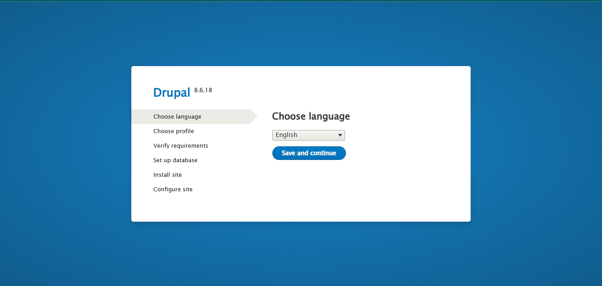

# 🌟 Task 4 - Deploy Drupal Application on Kubernetes Cluster

## 📌 Task Description

The Nautilus Application Development team plans to deploy a Drupal application on a Kubernetes cluster, allowing for a fresh installation to be performed manually. The DevOps team has outlined requirements for a MySQL backend with persistent storage, a Drupal frontend, and external access via a NodePort service. Your task is to create the required Kubernetes resources and ensure the Drupal installation page is accessible.

### Requirements:
1. **PersistentVolume**: Create `drupal-mysql-pv` with `hostPath: /drupal-mysql-data`, 5Gi storage, and `ReadWriteOnce` access mode.
2. **PersistentVolumeClaim**: Create `drupal-mysql-pvc` requesting 3Gi storage with `ReadWriteOnce` access mode.
3. **MySQL Deployment**: Create `drupal-mysql` with 1 replica, using `mysql:5.7`, and mount the PVC at `/var/lib/mysql`.
4. **Drupal Deployment**: Create `drupal` with 1 replica, using `drupal:8.6`.
5. **MySQL Service**: Create `drupal-mysql-service` to expose the MySQL deployment on port 3306.
6. **Drupal Service**: Create `drupal-service` as NodePort with `nodePort: 30095`.
7. **Verification**: Ensure all resources are running, and the Drupal installation page is accessible via the **App** button.

**Note**: The `kubectl` utility on the jump host is configured to work with the Kubernetes cluster. The `/drupal-mysql-data` directory exists on the worker node (jump host).

👉 **Your task**: Create the PersistentVolume, PersistentVolumeClaim, Secret, Deployments, and Services, apply them, and verify that the Drupal installation page is accessible.

---

## 🔧 Infrastructure Overview

**Target Environment**: Kubernetes Cluster  
**Resources**:
- PersistentVolume: `drupal-mysql-pv` for MySQL data storage
- PersistentVolumeClaim: `drupal-mysql-pvc` to request storage
- Secret: `drupal-mysql-secret` for MySQL credentials and database configuration
- Deployment: `drupal-mysql` for the MySQL backend
- Deployment: `drupal` for the Drupal frontend
- Service: `drupal-mysql-service` to expose MySQL internally
- Service: `drupal-service` to expose Drupal externally via NodePort
- Namespace: Default

**Working Directory**: Jump host with `kubectl` configured

---

## 📋 Solution Overview

### 🏗️ Architecture Components
- **PersistentVolume**: Provides 5Gi storage for MySQL data
- **PersistentVolumeClaim**: Requests 3Gi from the PersistentVolume
- **Secret**: Stores MySQL credentials and database name
- **MySQL Deployment**: Runs the MySQL backend with persistent storage
- **Drupal Deployment**: Runs the Drupal frontend, connecting to MySQL
- **Services**: Expose MySQL internally and Drupal externally on NodePort 30095
- **Application**: Drupal installation page accessible via HTTP

### 🎯 Implementation Strategy
1. Create a PersistentVolume and PersistentVolumeClaim for MySQL storage.
2. Create a Secret for MySQL credentials and database configuration.
3. Create a MySQL deployment with the PVC mounted and environment variables from the Secret.
4. Create a Drupal deployment with environment variables for MySQL connectivity.
5. Create services for MySQL (ClusterIP) and Drupal (NodePort).
6. Apply the configurations and verify resource creation.
7. Confirm the Drupal installation page is accessible via the **App** button.

---

## 🚨 Potential Errors to Avoid

1. **PersistentVolume Misconfiguration**:
   **Issue**: Incorrect `hostPath` or storage capacity.
   **Fix**: Ensure `hostPath: /drupal-mysql-data` and capacity `5Gi`.

2. **Secret Misconfiguration**:
   **Issue**: Incorrect key names or values in the Secret.
   **Fix**: Verify keys (`mysql-root-password`, `mysql-database`, `mysql-user`, `mysql-password`) and their values.

3. **Environment Variable Errors**:
   **Issue**: Incorrect `secretKeyRef` in deployments.
   **Fix**: Ensure environment variables reference the correct Secret and keys.

4. **Service Port Mismatch**:
   **Issue**: Incorrect ports for MySQL or Drupal services.
   **Fix**: Set MySQL service to `port: 3306` and Drupal service to `port: 80`, `nodePort: 30095`.

5. **PVC Not Bound**:
   **Issue**: PVC remains in `Pending` state.
   **Fix**: Verify PersistentVolume configuration and availability.

---

## 🚀 Implementation Steps

### Step 1: Connect to Jump Host
```bash
ssh thor@jumphost
```

**Purpose**: Access the jump host to execute `kubectl` commands.

---

### Step 2: Create Configuration File

#### Drupal and MySQL Configuration (`drupal-mysql-task4.yaml`)
Create or edit a file named `drupal-mysql-task4.yaml`:

```yaml
# 1. PersistentVolume for MySQL
apiVersion: v1
kind: PersistentVolume
metadata:
  name: drupal-mysql-pv
  namespace: default
spec:
  capacity:
    storage: 5Gi
  accessModes:
    - ReadWriteOnce
  hostPath:
    path: /drupal-mysql-data

---
# 2. PersistentVolumeClaim
apiVersion: v1
kind: PersistentVolumeClaim
metadata:
  name: drupal-mysql-pvc
  namespace: default
spec:
  accessModes:
    - ReadWriteOnce
  resources:
    requests:
      storage: 3Gi

---
# 3. Secret for MySQL
apiVersion: v1
kind: Secret
metadata:
  name: drupal-mysql-secret
  namespace: default
type: Opaque
stringData:
  mysql-root-password: rootpass123
  mysql-database: drupaldb
  mysql-user: drupaluser
  mysql-password: drupalpass

---
# 4. MySQL Deployment
apiVersion: apps/v1
kind: Deployment
metadata:
  name: drupal-mysql
  namespace: default
spec:
  replicas: 1
  selector:
    matchLabels:
      app: drupal-mysql
  template:
    metadata:
      labels:
        app: drupal-mysql
    spec:
      containers:
      - name: mysql
        image: mysql:5.7
        ports:
        - containerPort: 3306
          name: mysql-port
        env:
        - name: MYSQL_ROOT_PASSWORD
          valueFrom:
            secretKeyRef:
              name: drupal-mysql-secret
              key: mysql-root-password
        - name: MYSQL_DATABASE
          valueFrom:
            secretKeyRef:
              name: drupal-mysql-secret
              key: mysql-database
        - name: MYSQL_USER
          valueFrom:
            secretKeyRef:
              name: drupal-mysql-secret
              key: mysql-user
        - name: MYSQL_PASSWORD
          valueFrom:
            secretKeyRef:
              name: drupal-mysql-secret
              key: mysql-password
        volumeMounts:
        - mountPath: /var/lib/mysql
          name: mysql-storage
      volumes:
      - name: mysql-storage
        persistentVolumeClaim:
          claimName: drupal-mysql-pvc

---
# 5. MySQL Service
apiVersion: v1
kind: Service
metadata:
  name: drupal-mysql-service
  namespace: default
spec:
  selector:
    app: drupal-mysql
  ports:
  - protocol: TCP
    port: 3306
    targetPort: 3306

---
# 6. Drupal Deployment
apiVersion: apps/v1
kind: Deployment
metadata:
  name: drupal
  namespace: default
spec:
  replicas: 1
  selector:
    matchLabels:
      app: drupal
  template:
    metadata:
      labels:
        app: drupal
    spec:
      containers:
      - name: drupal
        image: drupal:8.6
        ports:
        - containerPort: 80
          name: drupal-port
        env:
        - name: DRUPAL_DB_HOST
          value: drupal-mysql-service
        - name: DRUPAL_DB_NAME
          valueFrom:
            secretKeyRef:
              name: drupal-mysql-secret
              key: mysql-database
        - name: DRUPAL_DB_USER
          valueFrom:
            secretKeyRef:
              name: drupal-mysql-secret
              key: mysql-user
        - name: DRUPAL_DB_PASSWORD
          valueFrom:
            secretKeyRef:
              name: drupal-mysql-secret
              key: mysql-password

---
# 7. Drupal NodePort Service
apiVersion: v1
kind: Service
metadata:
  name: drupal-service
  namespace: default
spec:
  type: NodePort
  selector:
    app: drupal
  ports:
  - protocol: TCP
    port: 80
    targetPort: 80
    nodePort: 30095
```

**Configuration Breakdown**:
- **PersistentVolume**:
  - **Name**: `drupal-mysql-pv`
  - **Namespace**: `default`
  - **Capacity**: `5Gi`
  - **Access Mode**: `ReadWriteOnce`
  - **Storage**: `hostPath` at `/drupal-mysql-data`
- **PersistentVolumeClaim**:
  - **Name**: `drupal-mysql-pvc`
  - **Namespace**: `default`
  - **Request**: `3Gi` with `ReadWriteOnce`
- **Secret**:
  - **Name**: `drupal-mysql-secret`
  - **Namespace**: `default`
  - **Keys**: `mysql-root-password: rootpass123`, `mysql-database: drupaldb`, `mysql-user: drupaluser`, `mysql-password: drupalpass`
- **MySQL Deployment**:
  - **Name**: `drupal-mysql`
  - **Namespace**: `default`
  - **Labels**: `app: drupal-mysql`
  - **Replicas**: 1
  - **Container**: `mysql`, image `mysql:5.7`, port 3306
  - **Environment Variables**: References Secret for MySQL configuration
  - **Volume**: Mounts `drupal-mysql-pvc` at `/var/lib/mysql`
- **Drupal Deployment**:
  - **Name**: `drupal`
  - **Namespace**: `default`
  - **Labels**: `app: drupal`
  - **Replicas**: 1
  - **Container**: `drupal`, image `drupal:8.6`, port 80
  - **Environment Variables**: References Secret and MySQL service for database connectivity
- **MySQL Service**:
  - **Name**: `drupal-mysql-service`
  - **Namespace**: `default`
  - **Type**: `ClusterIP`
  - **Selector**: `app: drupal-mysql`
  - **Ports**: `port: 3306`, `targetPort: 3306`
- **Drupal Service**:
  - **Name**: `drupal-service`
  - **Namespace**: `default`
  - **Type**: `NodePort`
  - **Selector**: `app: drupal`
  - **Ports**: `port: 80`, `targetPort: 80`, `nodePort: 30095`

**Save and Exit**: Press `Esc`, type `:wq`, press `Enter`.

---

### Step 3: Apply Configurations
```bash
kubectl apply -f drupal-mysql-task4.yaml
```

**Purpose**: Create the PersistentVolume, PersistentVolumeClaim, Secret, Deployments, and Services in the Kubernetes cluster.

**Expected Output**:
```
persistentvolume/drupal-mysql-pv created
persistentvolumeclaim/drupal-mysql-pvc created
secret/drupal-mysql-secret created
deployment.apps/drupal-mysql created
service/drupal-mysql-service created
deployment.apps/drupal created
service/drupal-service created
```

---

### Step 4: Verify Resources
```bash
kubectl get pv drupal-mysql-pv
```

**Expected Output**:
```
NAME              CAPACITY   ACCESS MODES   RECLAIM POLICY   STATUS   CLAIM                     AGE
drupal-mysql-pv   5Gi        RWO            Retain           Bound    default/drupal-mysql-pvc  2m
```

```bash
kubectl get pvc drupal-mysql-pvc
```

**Expected Output**:
```
NAME                STATUS   VOLUME            CAPACITY   ACCESS MODES   AGE
drupal-mysql-pvc    Bound    drupal-mysql-pv   5Gi        RWO            2m
```

```bash
kubectl get secret drupal-mysql-secret
```

**Expected Output**:
```
NAME                  TYPE     DATA   AGE
drupal-mysql-secret   Opaque   4      2m
```

```bash
kubectl get deployments.apps drupal-mysql drupal
```

**Expected Output**:
```
NAME            READY   UP-TO-DATE   AVAILABLE   AGE
drupal-mysql    1/1     1            1           2m
drupal          1/1     1            1           2m
```

```bash
kubectl get pod -l app=drupal-mysql
kubectl get pod -l app=drupal
```

**Expected Output**:
```
NAME                             READY   STATUS    RESTARTS   AGE
drupal-mysql-7c8f9d4b5-xyz123   1/1     Running   0          2m
NAME                     READY   STATUS    RESTARTS   AGE
drupal-6d9c8f7b4-abc456 1/1     Running   0          2m
```

```bash
kubectl get svc drupal-mysql-service drupal-service
```

**Expected Output**:
```
NAME                   TYPE       CLUSTER-IP      EXTERNAL-IP   PORT(S)          AGE
drupal-mysql-service   ClusterIP  10.96.123.456   <none>        3306/TCP         2m
drupal-service         NodePort   10.96.123.789   <none>        80:30095/TCP     2m
```

```bash
kubectl describe svc drupal-service
```

**Expected Output**:
```
Name:                     drupal-service
Namespace:                default
Labels:                   <none>
Annotations:              <none>
Selector:                 app=drupal
Type:                     NodePort
IP Family Policy:         SingleStack
IP Families:              IPv4
IP:                       10.96.123.789
IPs:                      10.96.123.789
Port:                     <unset>  80/TCP
TargetPort:               80/TCP
NodePort:                 <unset>  30095/TCP
Endpoints:                10.244.0.9:80
Session Affinity:         None
External Traffic Policy:  Cluster
Events:                   <none>
```

---

### Step 5: Verify MySQL Database (optional)
```bash
POD=$(kubectl get pod -l app=drupal-mysql -o jsonpath='{.items[0].metadata.name}')
kubectl exec -it $POD -- mysql -u drupaluser -pdrupalpass -e "SELECT DATABASE();"
```

**Expected Output**:
```
+--------------------+
| DATABASE()         |
+--------------------+
| drupaldb           |
+--------------------+
```

**Purpose**: Confirm the MySQL database `drupaldb` is created and accessible.

---

### Step 6: Verify PersistentVolume Mount (optional)
```bash
kubectl exec $POD -- ls /var/lib/mysql
```

**Expected Output**:
```
auto.cnf    ib_buffer_pool  ibdata1  ib_logfile0  ib_logfile1  drupaldb
```

**Purpose**: Confirm the PersistentVolume is mounted at `/var/lib/mysql`.

---

### Step 7: Verify Application Accessibility
**Access the Application**:
- Click the **App** button in the lab interface the page appers as



**Expected Output**: The Drupal installation page is displayed.

**Purpose**: Confirm the Drupal application is accessible and shows the installation page.

---

## 🔍 Code Analysis

### Drupal and MySQL Configuration (`drupal-mysql-task4.yaml`)
```yaml
# 1. PersistentVolume for MySQL
apiVersion: v1
kind: PersistentVolume
metadata:
  name: drupal-mysql-pv
  namespace: default
spec:
  capacity:
    storage: 5Gi
  accessModes:
    - ReadWriteOnce
  hostPath:
    path: /drupal-mysql-data

---
# 2. PersistentVolumeClaim
apiVersion: v1
kind: PersistentVolumeClaim
metadata:
  name: drupal-mysql-pvc
  namespace: default
spec:
  accessModes:
    - ReadWriteOnce
  resources:
    requests:
      storage: 3Gi

---
# 3. Secret for MySQL
apiVersion: v1
kind: Secret
metadata:
  name: drupal-mysql-secret
  namespace: default
type: Opaque
stringData:
  mysql-root-password: rootpass123
  mysql-database: drupaldb
  mysql-user: drupaluser
  mysql-password: drupalpass

---
# 4. MySQL Deployment
apiVersion: apps/v1
kind: Deployment
metadata:
  name: drupal-mysql
  namespace: default
spec:
  replicas: 1
  selector:
    matchLabels:
      app: drupal-mysql
  template:
    metadata:
      labels:
        app: drupal-mysql
    spec:
      containers:
      - name: mysql
        image: mysql:5.7
        ports:
        - containerPort: 3306
          name: mysql-port
        env:
        - name: MYSQL_ROOT_PASSWORD
          valueFrom:
            secretKeyRef:
              name: drupal-mysql-secret
              key: mysql-root-password
        - name: MYSQL_DATABASE
          valueFrom:
            secretKeyRef:
              name: drupal-mysql-secret
              key: mysql-database
        - name: MYSQL_USER
          valueFrom:
            secretKeyRef:
              name: drupal-mysql-secret
              key: mysql-user
        - name: MYSQL_PASSWORD
          valueFrom:
            secretKeyRef:
              name: drupal-mysql-secret
              key: mysql-password
        volumeMounts:
        - mountPath: /var/lib/mysql
          name: mysql-storage
      volumes:
      - name: mysql-storage
        persistentVolumeClaim:
          claimName: drupal-mysql-pvc

---
# 5. MySQL Service
apiVersion: v1
kind: Service
metadata:
  name: drupal-mysql-service
  namespace: default
spec:
  selector:
    app: drupal-mysql
  ports:
  - protocol: TCP
    port: 3306
    targetPort: 3306

---
# 6. Drupal Deployment
apiVersion: apps/v1
kind: Deployment
metadata:
  name: drupal
  namespace: default
spec:
  replicas: 1
  selector:
    matchLabels:
      app: drupal
  template:
    metadata:
      labels:
        app: drupal
    spec:
      containers:
      - name: drupal
        image: drupal:8.6
        ports:
        - containerPort: 80
          name: drupal-port
        env:
        - name: DRUPAL_DB_HOST
          value: drupal-mysql-service
        - name: DRUPAL_DB_NAME
          valueFrom:
            secretKeyRef:
              name: drupal-mysql-secret
              key: mysql-database
        - name: DRUPAL_DB_USER
          valueFrom:
            secretKeyRef:
              name: drupal-mysql-secret
              key: mysql-user
        - name: DRUPAL_DB_PASSWORD
          valueFrom:
            secretKeyRef:
              name: drupal-mysql-secret
              key: mysql-password

---
# 7. Drupal NodePort Service
apiVersion: v1
kind: Service
metadata:
  name: drupal-service
  namespace: default
spec:
  type: NodePort
  selector:
    app: drupal
  ports:
  - protocol: TCP
    port: 80
    targetPort: 80
    nodePort: 30095
```

### Resource Attributes
| Resource | Attribute | Value | Description |
|----------|-----------|-------|-------------|
| **PersistentVolume** | drupal-mysql-pv | capacity: 5Gi, hostPath: /drupal-mysql-data | Storage for MySQL data |
| **PersistentVolumeClaim** | drupal-mysql-pvc | request: 3Gi | Requests storage for MySQL |
| **Secret** | drupal-mysql-secret | mysql-root-password, mysql-database, mysql-user, mysql-password | MySQL credentials and database |
| **MySQL Deployment** | drupal-mysql | replicas: 1, app: drupal-mysql | Runs MySQL backend |
| **Drupal Deployment** | drupal | replicas: 1, app: drupal | Runs Drupal frontend |
| **MySQL Container** | mysql | image: mysql:5.7, port: 3306 | MySQL container |
| **Drupal Container** | drupal | image: drupal:8.6, port: 80 | Drupal container |
| **Volume** | mysql-storage | PVC: drupal-mysql-pvc | Mounted at /var/lib/mysql |
| **MySQL Service** | drupal-mysql-service | type: ClusterIP, port: 3306 | Exposes MySQL internally |
| **Drupal Service** | drupal-service | type: NodePort, port: 80, nodePort: 30095 | Exposes Drupal externally |

---

## ✅ Verification Steps

### Step 1: Verify PersistentVolume
```bash
kubectl get pv drupal-mysql-pv
```

**Expected Output**:
```
NAME              CAPACITY   ACCESS MODES   RECLAIM POLICY   STATUS   CLAIM                     AGE
drupal-mysql-pv   5Gi        RWO            Retain           Bound    default/drupal-mysql-pvc  2m
```

### Step 2: Verify PersistentVolumeClaim
```bash
kubectl get pvc drupal-mysql-pvc
```

**Expected Output**:
```
NAME                STATUS   VOLUME            CAPACITY   ACCESS MODES   AGE
drupal-mysql-pvc    Bound    drupal-mysql-pv   5Gi        RWO            2m
```

### Step 3: Verify Secret
```bash
kubectl get secret drupal-mysql-secret
```

**Expected Output**:
```
NAME                  TYPE     DATA   AGE
drupal-mysql-secret   Opaque   4      2m
```

### Step 4: Verify Deployments
```bash
kubectl get deployments.apps drupal-mysql drupal
```

**Expected Output**:
```
NAME            READY   UP-TO-DATE   AVAILABLE   AGE
drupal-mysql    1/1     1            1           2m
drupal          1/1     1            1           2m
```

### Step 5: Verify Pods
```bash
kubectl get pod -l app=drupal-mysql
kubectl get pod -l app=drupal
```

**Expected Output**:
```
NAME                             READY   STATUS    RESTARTS   AGE
drupal-mysql-7c8f9d4b5-xyz123   1/1     Running   0          2m
NAME                     READY   STATUS    RESTARTS   AGE
drupal-6d9c8f7b4-abc456 1/1     Running   0          2m
```

### Step 6: Verify Services
```bash
kubectl get svc drupal-mysql-service drupal-service
```

**Expected Output**:
```
NAME                   TYPE       CLUSTER-IP      EXTERNAL-IP   PORT(S)          AGE
drupal-mysql-service   ClusterIP  10.96.123.456   <none>        3306/TCP         2m
drupal-service         NodePort   10.96.123.789   <none>        80:30095/TCP     2m
```

### Step 7: Verify MySQL Service Endpoints
```bash
kubectl describe svc drupal-mysql-service
```

**Expected Output**:
```
Name:                     drupal-mysql-service
Namespace:                default
Labels:                   <none>
Annotations:              <none>
Selector:                 app=drupal-mysql
Type:                     ClusterIP
IP Family Policy:         SingleStack
IP Families:              IPv4
IP:                       10.96.123.456
IPs:                      10.96.123.456
Port:                     <unset>  3306/TCP
TargetPort:               3306/TCP
Endpoints:                10.244.0.8:3306
Session Affinity:         None
Events:                   <none>
```

### Step 8: Verify Drupal Service Endpoints
```bash
kubectl describe svc drupal-service
```

**Expected Output**:
```
Name:                     drupal-service
Namespace:                default
Labels:                   <none>
Annotations:              <none>
Selector:                 app=drupal
Type:                     NodePort
IP Family Policy:         SingleStack
IP Families:              IPv4
IP:                       10.96.123.789
IPs:                      10.96.123.789
Port:                     <unset>  80/TCP
TargetPort:               80/TCP
NodePort:                 <unset>  30095/TCP
Endpoints:                10.244.0.9:80
Session Affinity:         None
External Traffic Policy:  Cluster
Events:                   <none>
```

### Step 9: Verify MySQL Database (optional)
```bash
POD=$(kubectl get pod -l app=drupal-mysql -o jsonpath='{.items[0].metadata.name}')
kubectl exec -it $POD -- mysql -u drupaluser -pdrupalpass -e "SELECT DATABASE();"
```

**Expected Output**:
```
+--------------------+
| DATABASE()         |
+--------------------+
| drupaldb           |
+--------------------+
```

### Step 10: Verify Application
```bash
curl http://<node-ip>:30095
```

**Expected Output**: The Drupal installation page is displayed.

---

## 🧪 Testing

### Verify MySQL Port
```bash
POD=$(kubectl get pod -l app=drupal-mysql -o jsonpath='{.items[0].metadata.name}')
kubectl exec $POD -- netstat -tuln
```

**Expected Output**:
```
Active Internet connections (only servers)
Proto Recv-Q Send-Q Local Address           Foreign Address         State
tcp        0      0 0.0.0.0:3306            0.0.0.0:*               LISTEN
```

**Purpose**: Confirm MySQL is listening on port 3306.

### Verify Drupal Port
```bash
POD=$(kubectl get pod -l app=drupal -o jsonpath='{.items[0].metadata.name}')
kubectl exec $POD -- netstat -tuln
```

**Expected Output**:
```
Active Internet connections (only servers)
Proto Recv-Q Send-Q Local Address           Foreign Address         State
tcp        0      0 0.0.0.0:80              0.0.0.0:*               LISTEN
```

**Purpose**: Confirm Drupal is listening on port 80.

### Verify PersistentVolume Mount
```bash
POD=$(kubectl get pod -l app=drupal-mysql -o jsonpath='{.items[0].metadata.name}')
kubectl exec $POD -- ls /var/lib/mysql
```

**Expected Output**:
```
auto.cnf    ib_buffer_pool  ibdata1  ib_logfile0  ib_logfile1  drupaldb
```

**Purpose**: Confirm the PersistentVolume is correctly mounted.

---

## 📚 Quick Command Reference
```bash
# Apply configurations
kubectl apply -f drupal-mysql-task4.yaml

# Verify resources
kubectl get pv drupal-mysql-pv
kubectl get pvc drupal-mysql-pvc
kubectl get secret drupal-mysql-secret
kubectl get deployments.apps drupal-mysql drupal
kubectl get pod -l app=drupal-mysql
kubectl get pod -l app=drupal
kubectl get svc drupal-mysql-service drupal-service

# Verify MySQL database
POD=$(kubectl get pod -l app=drupal-mysql -o jsonpath='{.items[0].metadata.name}')
kubectl exec -it $POD -- mysql -u drupaluser -pdrupalpass -e "SELECT DATABASE();"

# Verify PersistentVolume mount
kubectl exec $POD -- ls /var/lib/mysql

# Test application
curl http://<node-ip>:30095
```

---

## 🛠️ Troubleshooting Common Issues

### Issue 1: Pods Not Running
**Symptoms**: Pods in `Pending` or `CrashLoopBackOff`.  
**Solution**: Check pod events and logs.
```bash
kubectl describe pod -l app=drupal-mysql
kubectl describe pod -l app=drupal
kubectl logs -l app=drupal-mysql
kubectl logs -l app=drupal
```

### Issue 2: PersistentVolumeClaim Not Bound
**Symptoms**: `kubectl get pvc` shows `Pending`.  
**Solution**: Verify PersistentVolume configuration.
```bash
kubectl describe pv drupal-mysql-pv
kubectl describe pvc drupal-mysql-pvc
```

### Issue 3: Service Has No Endpoints
**Symptoms**: `kubectl describe svc` shows `Endpoints: <none>`.  
**Solution**: Verify selector and port alignment.
```bash
kubectl get pod -l app=drupal-mysql -o wide
kubectl get pod -l app=drupal -o wide
kubectl describe svc drupal-mysql-service
kubectl describe svc drupal-service
```

### Issue 4: Image Pull Failure
**Symptoms**: Pods fail with `ImagePullBackOff`.  
**Solution**: Verify image names (`mysql:5.7`, `drupal:8.6`).
```bash
kubectl describe pod -l app=drupal-mysql
kubectl describe pod -l app=drupal
```

### Issue 5: Drupal Cannot Connect to MySQL
**Symptoms**: Drupal installation page shows database connection errors.  
**Solution**: Verify MySQL service and Secret values.
```bash
kubectl describe svc drupal-mysql-service
kubectl describe secret drupal-mysql-secret
```

---

## 💡 Additional Tips
- **Pod Logs**: Check for errors in MySQL or Drupal.
  ```bash
  kubectl logs -l app=drupal-mysql
  kubectl logs -l app=drupal
  ```
- **Dry Run**: Test configurations before applying.
  ```bash
  kubectl apply -f drupal-mysql-task4.yaml --dry-run=client
  ```
- **NodePort Range**: Ensure 30095 is within 30000-32767.
- **MySQL Client**: Test database connectivity.
  ```bash
  POD=$(kubectl get pod -l app=drupal-mysql -o jsonpath='{.items[0].metadata.name}')
  kubectl exec -it $POD -- mysql -u drupaluser -pdrupalpass
  ```
- **Drupal Access**: Verify the installation page.
  ```bash
  curl http://<node-ip>:30095
  ```

---

## 🚨 Task-Specific Challenge & Solution

### 🔍 Main Challenges Encountered:
1. **Persistent Storage**: Configuring the PersistentVolume and PersistentVolumeClaim with the correct `hostPath`.
2. **MySQL Configuration**: Setting up MySQL with a Secret for secure credentials.
3. **Drupal Connectivity**: Ensuring Drupal connects to the MySQL service using the correct environment variables.
4. **Service Exposure**: Exposing Drupal on the specified NodePort.

### 💡 Solution Approach:
1. **Persistent Storage**: Created `drupal-mysql-pv` and `drupal-mysql-pvc` with specified storage and access mode.
2. **Secret**: Defined `drupal-mysql-secret` with MySQL credentials and database name.
3. **Deployments**: Configured `drupal-mysql` with PVC mount and `drupal` with MySQL connectivity.
4. **Services**: Set up `drupal-mysql-service` (ClusterIP) and `drupal-service` (NodePort 30095).
5. **Verification**: Confirmed resource creation, database accessibility, and Drupal installation page.

### 🎯 Key Success Factors:
- **PersistentVolume**: Ensures MySQL data persistence.
- **Secret**: Securely manages MySQL credentials.
- **Deployments**: Correctly configured for MySQL and Drupal.
- **Services**: Expose MySQL internally and Drupal externally.
- **Application**: Displays the Drupal installation page.

### ⚠️ Critical Configuration Details:
- **PersistentVolume**: `drupal-mysql-pv`, 5Gi, `hostPath: /drupal-mysql-data`
- **PersistentVolumeClaim**: `drupal-mysql-pvc`, 3Gi
- **Secret**: `drupal-mysql-secret`
- **Deployments**: `drupal-mysql` (mysql:5.7), `drupal` (drupal:8.6)
- **Services**: `drupal-mysql-service` (port 3306), `drupal-service` (NodePort 30095)

### 🔒 Kubernetes Benefits:
- **Persistence**: PersistentVolume ensures data durability.
- **Security**: Secrets manage sensitive data.
- **Accessibility**: NodePort enables external access to Drupal.
- **Reliability**: Kubernetes manages deployment health.

---

## ⚠️ Important Production Notes
🔧 **Deployment Strategy**: Use `RollingUpdate` for zero-downtime updates.  
🔐 **Security**: Implement network policies to restrict MySQL and Drupal access.  
📊 **Monitoring**: Monitor MySQL and Drupal performance.  
🛡️ **Backup**: Configure backups for the PersistentVolume.  
🌐 **Production Storage**: Replace `hostPath` with a production-grade storage class.

---

## 📖 Learning Outcomes
**Key Concepts Mastered**:
- **PersistentVolume and PersistentVolumeClaim**: Managing storage for MySQL.
- **Secrets**: Securely storing and referencing credentials.
- **Deployments**: Configuring MySQL and Drupal with environment variables.
- **Services**: Exposing applications via ClusterIP and NodePort.
- **Troubleshooting**: Verifying resource configurations and application connectivity.

**Kubernetes Features Used**:
- `v1 PersistentVolume` and `v1 PersistentVolumeClaim` for storage.
- `v1 Secret` for credential management.
- `apps/v1 Deployment` for MySQL and Drupal.
- `v1 Service` for ClusterIP and NodePort exposure.

---

## 🎯 Task Completion Summary
✅ **Successfully Completed**:
- **PersistentVolume** - Created `drupal-mysql-pv` with 5Gi storage.
- **PersistentVolumeClaim** - Created `drupal-mysql-pvc` requesting 3Gi.
- **Secret** - Created `drupal-mysql-secret` with MySQL credentials.
- **Deployments** - Created `drupal-mysql` and `drupal` with specified images.
- **Services** - Created `drupal-mysql-service` (ClusterIP) and `drupal-service` (NodePort 30095).
- **Verification** - Confirmed resources are running and Drupal installation page is accessible.

**Final Status**: 🎉 **Task completed successfully with all requirements met**

**Application Foundation**: The Drupal application is deployed with a MySQL backend, persistent storage, and external access via NodePort 30095, displaying the Drupal installation page, ready for manual setup by the Nautilus Application Development team.

### 🔮 Application Ready for:
- **Installation**: Complete the Drupal setup via the installation page.
- **Scaling**: Add replicas or use autoscaling for Drupal.
- **Security**: Implement network policies and HTTPS.
- **Monitoring**: Add health checks and metrics collection.
- **Backups**: Configure regular database backups.

